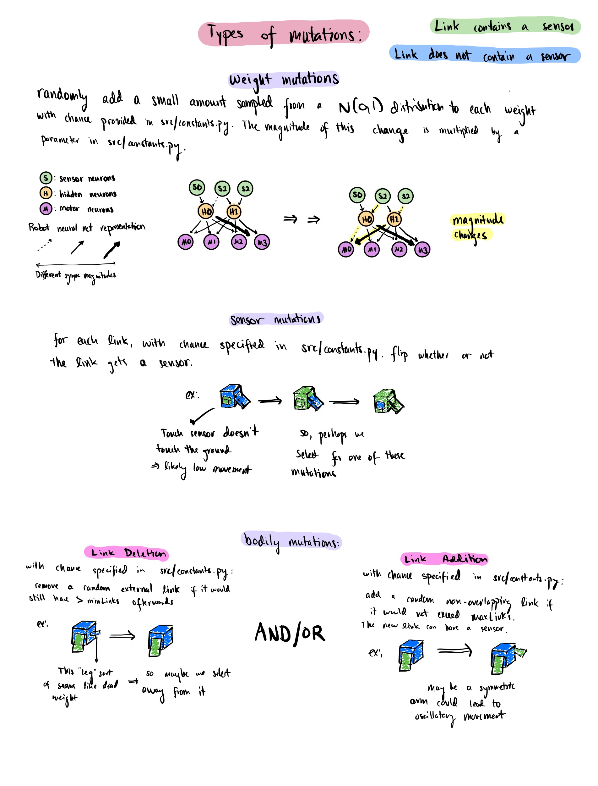
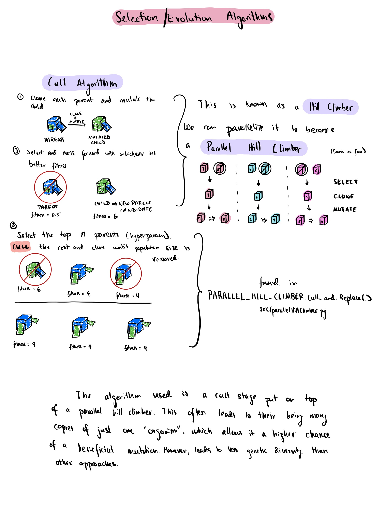
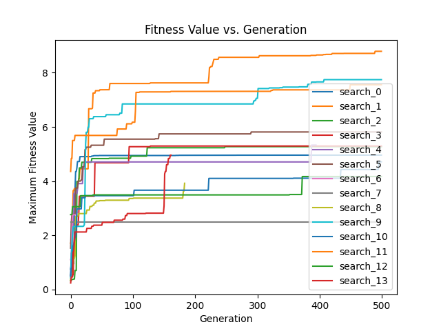
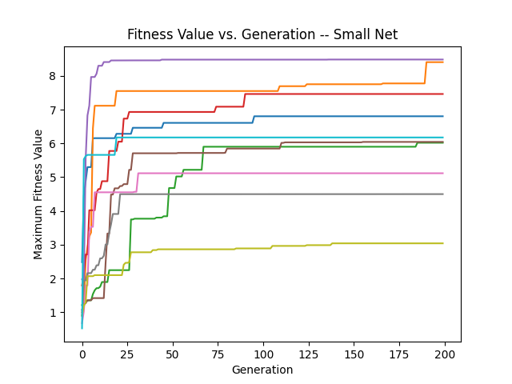
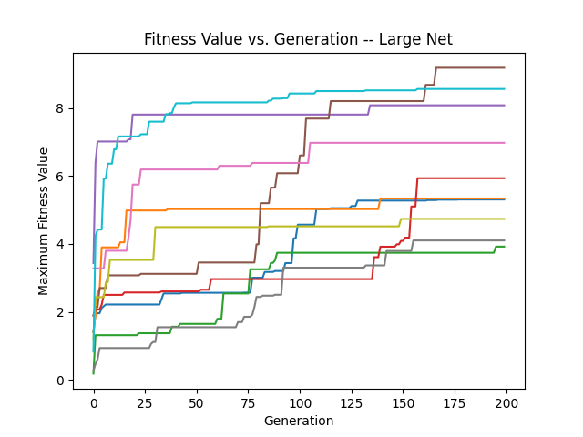

# Artificial Life Final Project -- The Engineer

## Teaser Gif (sorry for low quality)
https://youtu.be/wFkkGInAI88

## Environment Setup

All of the used modules can be found in `requirements.txt`. It is recommended to create a local environment (for example, using `python3 -m venv env`),
and installing the requirements locally with `pip3 -r requirements.txt`. I ran this on python 3.11, though I don't think there should be any problems using 3.10 or 3.9.

## 2-minute video
https://youtu.be/f3OT6gh_v04

## Methods
Below are the run instrunctions, as well a diagram explaining the program flow through the different files of this repository, as well as diagrams explaining brain & body generation and representation, mutation, and evolution throughout the generations.

### Run instructions
  - Scripts need to be run as modules.
    - `python -m scripts.search {name}` runs a search and saves the best result to `saved_searches/` under the name of `name`.
    - `python -m scripts.runner` runs multiple searches. It saves the sequence of max fitness per generation to a `.txt` file in the folder `evolutions/`.
    - `python -m scripts.analysis` currently graphs the searches saved in `evolutions/`. 
    - `python -m scripts.viewSaved` plays all of the simulations saved to `saved_searches/`.
    - `python -m scripts.clearSaved` clears the `saved_searches/` directory.
    
### Program flow
- The flow is as follows:
- Run `python -m scripts.search {name}`
  - `scripts/search.py` -> `src/parallelHillClimber.py` -> `src/solution.py` -> `src/simulate.py` -> `src/simulation.py`. Robots, Brains, and Body generation are handled in `src/solution.py` and `src/simulation.py` for the most part.
    
### Body/Brain Generation, Mutation, and Evolution

## Results
- Here are the fitness curves from running ~14 trials (though 4 terminated early due to a strange concurrency bug), with 500 generations and population size of 10:
  - 
  - there is a kind of elbow in the graph around ~40/50th trial, then huge amounts of flat space, occasionally raising slightly. This means that the algorithm is getting stuck in local maxima constantly, and for long periods of time.
- It makes sense that a hill-climbing based approach would get stuck in local maxima, as it cannot go down the hill to try and find another maximum. It instead needs a significant mutation that can allow it to hop from the maximum onto a nearby slope (sort of). In general, I found that movement was heavily driven by the links touching the ground (duh, like legs), but to an extremely large extent. The only sensors were touch based, so evolution mainly revolved around getting beneficial sensor placement, or adding more touch points either to sense or to scoop the robot along the ground. The links that did not touch the ground seemed to only really serve the purpose of provinding weight for the robot to fall on certain points and then scuttle around, or to "vibrate" in some way that initiated scooping motions on the ground. Below are two links to videos of genealogies
- (https://youtu.be/gWcs_j5P67M)
  - In the first video, the simple body first evolves different neural net weights to angle its upper piece at a favorable angle to fall forward, then evolves another block to cause it to fall on its side and move forward.
- (https://youtu.be/rSyv0wJxKZY)
  -  In the second video, the contact point-based evolution is clear. First it evolves to have a sensor to touch the ground, using the large square and small rectangle sheet to scoop itself along. The rest of the evolution evolves more weight to alter how the two main "movers" work, eventually adding some sort of arm that falls forward and works as a sensorless "scooper".
- Something else that I was interested in was the effect of the shape of the robot's neural net (which I held constant) on the shape of the max_fitness curve. So, I ran an abbreviated simulation comparing small-net (4,2,) -- the same used in the above trial, with large-net (16,8,4). Both simulations ran with population size 10, for 200 generations, and were run 10 separate times. The graphs are presented below.
- 
- 
- Something that instantly jumped out to me was how with the smaller net, the vast majority of the improvement via mutation ocurred within the first 100 generations, whereas with the larger net, many of the trials improved throughout the run, with very few having extremely long flat segments of no improvement. At first glance this makes sense, that a larger neural net would improve for longer as it has a much larger search space, but what is interesting about this is that the neural net only controls how the robot moves in response its sensors, and doesn't control as directly how the model decides what a "good" robot is. I don't fully understand why the larger net robots don't get stuck in local maxima for as long as the small-net robots do. Perhaps it would be interesting to run the comparison for more generations to see if this increasing trend continues, and for how long. It is also possible that this sample is due to a small sample size.
- As seen in the above graphs, there are often periods of long stagnation in evolution. This is expected with a hill climber-based evolutionary algorithm, as no change in the organism will occur if there was no beneficial mutation. Mutations do not occur every cycle (see 
- In the future it would be interesting to compare the currently used evolutionary algorithm, which stifles genetic diversity but allows for more opportunities for one individual solution to escape a local max, with evolutionary algorithms that do not use hill-climbing, allowing for temporary dips in fitness, as well as with algorithms that allow for a greater amount of diversity.

### Citation
this project was inspired by https://www.reddit.com/r/ludobots/
and builds upon the following pyrosim repo: https://github.com/jbongard/pyrosim
