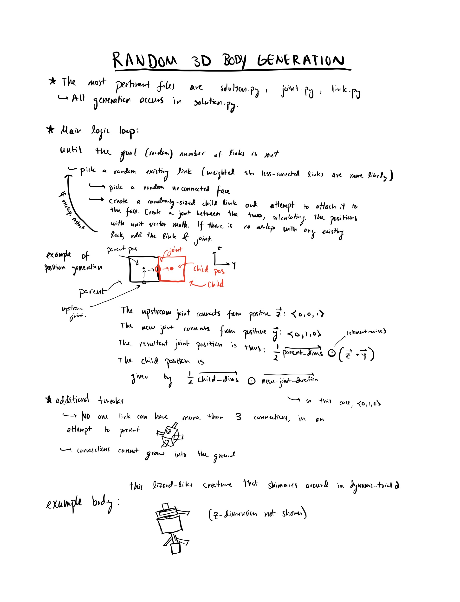
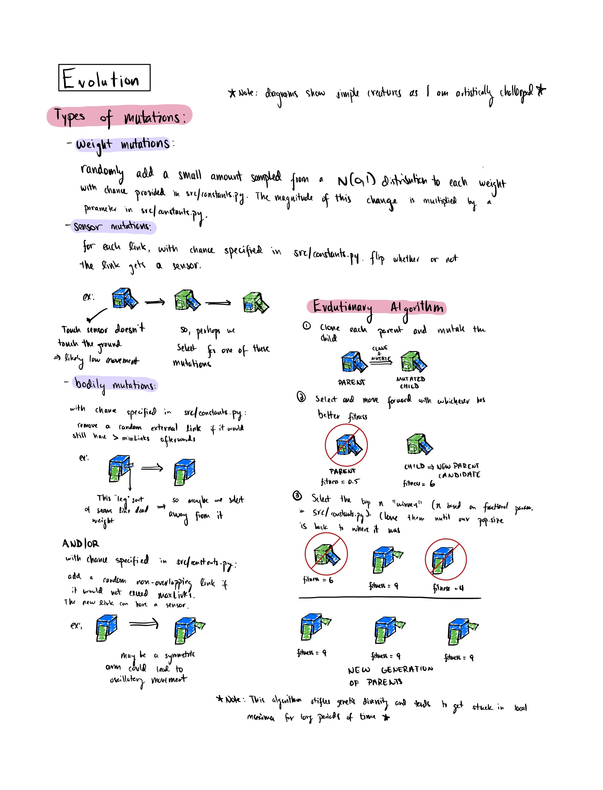

# Artificial Life Assignment 8

### Environment Setup

All of the used modules can be found in `requirements.txt`. It is recommended to create a local environment (for example, using `python3 -m venv env`),
and installing the requirements locally with `pip3 -r requirements.txt`.

### Run instructions
  - Scripts need to be run as modules now.
    - `python3 -m scripts.search {name}` runs a search and saves the best result to `saved_searches/` under the name of `name`.
    - `python3 -m scripts.runner` runs multiple searches. I have it set up so that if it runs 5 searches, it will plot their max fitness vs. generation.
    - `python3 -m scripts.viewSaved` plays all of the simulations saved to `saved_searches/`.
    - `python3 -m scripts.clearSaved` clears the `saved_searches/` directory.
    
### Body/Brain Generation, Mutation, and Evolution
 
 
 
### Citation
this project was inspired by https://www.reddit.com/r/ludobots/
and builds upon the following pyrosim repo: https://github.com/jbongard/pyrosim
